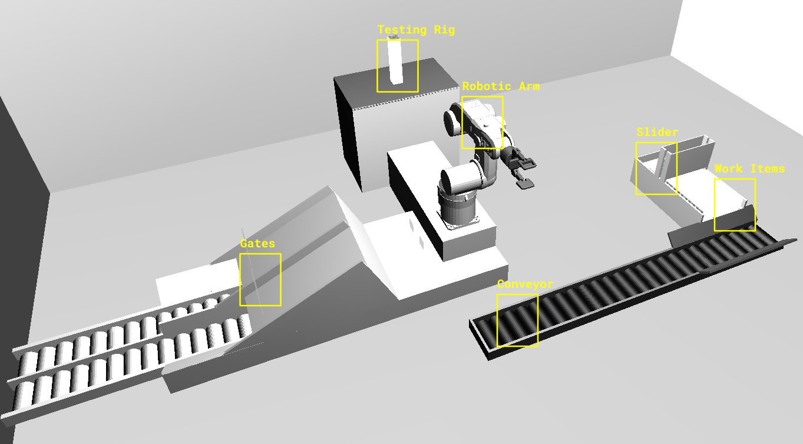
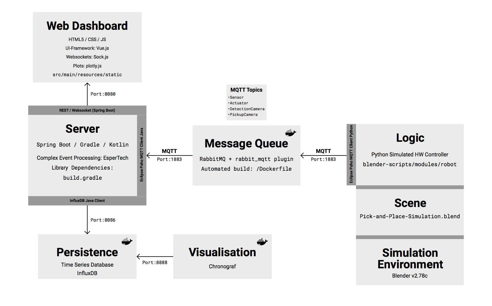
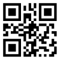

# MDE for IoT - Digital Twin

*"MDE for IoT - Digital Twin"* ist ein zweimonatiges Projekt, das Technologien für die modellgetriebene Entwicklung von Produktionssystemen und digitale Zwillinge erprobt. Technologien beinhalten die Simulation von physischen Maschinen, die Verarbeitung von Sensordaten mit CEP und Monitoring und Steuerung mit Webtechnologien.

Code repository: [https://github.com/rafaelkonlechner/cdl-pick-and-place](https://github.com/rafaelkonlechner/cdl-pick-and-place)

## Überblick

Das Szenario und die Simulation beschreiben eine Pick-and-Place-Einheit einer Fertigungsstraße. Diese Einheit besteht wiederum aus drei Komponenten: Roboterarm (6 Freiheitsgrade), Förderband und Prüfstand.

 *Simulierte Szene: Pick and Place Unit*

Die einzelnen Einheiten kommunizieren über MQTT mit dem Server. Der Server speichert die zentrale Abfolgelogik der Anlage und steuert diese mit Befehlen über MQTT. Die Simulation wird von einer Logik kontrolliert, die einen Hardwarecontroller simuliert.

### Architekturübersicht
 *Architektur des vorgestellten Systems*

### Sensordaten der Pick-and-Place Unit
Folgende Sensoren werden im Szenario berücksichtigt und können über das MQTT-Topic `Sensor` ausgelesen werden:

* Winkelsensor für Achsen und Greifer (6 Freiheitsgrade, Bogenmaß)
* Absolute Raumposition des Greifers (kartesische Koordinaten)
* Berührungssensor am Greifarm (Kontakt / kein Kontakt)
* Kamera am Prüfstand (Bildübertragung)
* Kamera am Förderband (Bildübertragung)
* Position des Nachschiebers für Werkstücke (1 Freiheitsgrad)
* Position des Gleichrichters für die Ausrichtung am Förderband
* Lichtschranke für beide Teilbahnen nach Sortierung

### Aktuatoren für Pick-and-Place Unit
Folgende Aktuatoren werden unterstützt:

* Rotationsmotoren für Achsen und Greifer (6 Motoren, derzeit 5 ansteuerbar)
* Linearmotor für Schieber
* Linearmotor für Gleichrichter am Förderband
* Linearmotor für Neigung der Testplattform zum Entfernen umgekippter Werkstücke

## MQTT API

Die MQTT API macht alle Sensoren und Aktuatoren des Roboters nachrichtenbasiert (mit Publish-Subscribe) und unmittelbar — also ohne dazwischenliegende Abstraktionsebene — zugänglich. Der simulierte Hardware-Controller enthält nur die notwendige Logik, um Sensorik und Aktuatoren über die API zugänglich zu machen.  Über das *Actuator*-Topic nimmt er ausschließlich einfache `goto`-Befehle für alle verfügbaren Rotations- und Linearmotoren entgegen. Somit bleibt die hardwarenahe Controller-Software konzeptionell sehr einfach und wartungsfreundlich. Der Vorteil dieses Ansatzes liegt in der Austauschbarkeit der Ablaufprogramme. Klassische Programme können die Pick-and-Place-Unit ebenso steuern wie modellgetriebene Ansätze, zB. mit Enterprise Architect.

### Observation Topics
Zur Feststellung des aktuellen Systemzustandes können folgende Topics für eingehende Daten abonniert werden:

* `Sensor`: Abonniert man dieses Topic, erhält man im Abstand von wenigen Millisekunden die Daten aller oben beschriebenen Sensoren, exklusive der Kameras. Aufgrund der größeren Datenmenge werden Kameras einzeln abonniert.
* `PickupCamera`: Enthält das Kamerabild auf das Förderband, zur Aufnahmeunterstützung des Roboters. Die Nachrichten von Camera-Topics enthalten als Payload unmittelbar die Base64-codierte Bilddatei.
* `DetectionCamera`: Enthält das Kamerabild auf die Prüfstation, auch als Base64-codierte Bilddatei.

#### Nachrichtenformat für Sensor-Topic
Nachrichten des Sensor-Topics entsprechen dem JSON-Dateiformat und spezifizieren die sendende Einheit, sowie die gemessenen Daten. Die folgenden Beispiele zeigen je eine Nachricht pro Einheit (*entity*):

```
{
	"entity": "RoboticArm",        // Name der Sendeeinheit
	"basePosition": 0.0,           // Neigung d. Basis [-Pi,Pi]
	"mainArmPosition": 0.0,        // Analog für Hauptarm
	"secondArmPosition": 0.0,      // Analog für Vorderarm
	"wristPosition": 0.0,          // Analog für Drehgelenk
	"gripperPosition": 0.0,        // Analog für Greifer
	"handPosition": <0.0,0.0,0.0>, // Position d. Greifers
	"gripperHasContact": false     // Kontaktsensor d. Greifers
}
{
	"entity": "Slider",
	"sliderPosition": 0.0          // x-Koordinate d. Schiebers
}
{
	"entity": "Conveyor",
	"adjusterPosition": 0.0         // x-Koordinate d. Richters
}
{
	"entity": "TestingRig",
	"platformPosition": 0.0         // Neigung d. Plattform
}
```

Die Sensordaten werden alle ~16 ms versendet und können von einem beliebigen Client ausgelesen werden. Das entsprechende Blender-Script `sensors.py` wird bei jedem zehnten Frame ausgeführt. Siehe: [sensors.py](https://github.com/rafaelkonlechner/cdl-pick-and-place/blob/master/blender-scripts/modules/robot/sensors.py)

### Control Topics
Folgende Topics sind von der Pick-and-Place-Unit abonniert und können für die Abgabe von Befehlen an die Pick-and-Place Unit genutzt werden:

* `Actuator`: Befehle an diese Topic werden unmittelbar vom Controller ausgeführt. Aufgrund der Einfachheit des Controllers werden ausschließlich Befehle unterstützt, bei denen ein Zielwert für einen Aktuator angegeben wird. Es gibt keine dedizierte Bestätigungsnachricht (*Acknowledge*) oder Erfolgsnachricht (*Success*) vom Controller. Bestätigung und Erfolg müssen anhand der übermittelten Sensordaten überprüft werden.

#### Nachrichtenformat für Actuator-Topic
Das Nachrichtenformat entspricht einem einfachen Wertepaar *[name]-goto value (speed)*, bei dem zuerst der Aktuator (*name*) und danach der Zielwert (*value*) angegeben wird. An die Komponente wird "-goto" als Suffix angefügt. Die Rotationsmotoren des Roboterarms unterstützen außerdem noch die Angabe der Rotationsgeschwindigkeit (*speed*). Beispiele:

* `"base-goto 0.0 1.0"`: Lokale Rotation der Basis (Intervall [-Pi, Pi], Maximale Drehgeschwindigkeit der Bewegung)
* `"main_arm-goto 0.0"`: Analog für den Hauptarm
* `"second_arm-goto 0.0 "`: Analog für den Vorderarm
* `"wrist-goto 0.0 "`: Analog für das hintere Drehgelenk
* `"gripper-goto 0.0"`: Analog für den Greifer
* `"hand-goto <0.0, 0.0, 0.0>"` Absolute Position der Handinnenfläche (*noch nicht implementiert*)
* `"slider-goto 0.0"`: x-Koordinate des Schiebers
* `"adjuster-goto 0.0"` x-Koordinate des Gleichrichters

## Anlagensteuerung

Die Anlagensteuerung erfolgt über die kontrollierte Abfolge von definierten Zuständen der Anlage.

### Zustände
Ein Zustand der Pick-and-Place-Unit setzt sich zusammen aus den Aktuator-Positionen des Roboterarms, der Anzahl der Werkstücke auf dem Fließband (0 oder 1), der Unterscheidung, ob das Werkstück im Aufnahmefenster liegt, oder nicht, der Unterscheidung, ob gerade ein Objekt im Greifer liegt oder nicht, sowie der Position des Schiebereglers und der des Gleichrichters. Im Dashboard sind bereits alle nötigen Zustände zur Aufnahme und Sortierung der Objekte definiert. Zwischen den definierten Zuständen kann beliebig gewechselt werden. Eine Produktion — also das Aufnehmen, Abstellen, Prüfen und Sortieren — entspricht einer geordneten Ausführung einer vorher definierten Zustandsfolge.

Die Klasse `Context` konsolidiert die Sicht auf alle Zustände. Siehe: [Context.kt](https://github.com/rafaelkonlechner/cdl-pick-and-place/blob/master/MQTTServer/src/main/kotlin/at/ac/tuwien/big/entity/state/Context.kt)

Alle Zustände sind in der Klasse `States` definiert. Siehe [States.kt](https://github.com/rafaelkonlechner/cdl-pick-and-place/blob/master/MQTTServer/src/main/kotlin/at/ac/tuwien/big/States.kt)

### *Automatic*-Modus

Mit dem *Automatic*-Modus können vollständige Durchläufe durchgespielt werden, sofern es zu keinen Ausnahmen oder Fehlern kommt ("Start"-Button im Client drücken). In diesem Modus versucht der Server den aktuellen Zustand der Unit zu erkennen und leitet bei erkennen eines definierten Zustandes den vorgegebenen Folgezustand ein.

#### Funktionsweise
Über MQTT erhält der Server regelmäßig Sensor-Updates über die jeweiligen Zustände der Einheiten (separat für Roboterarm, Schieber, Förderband und Kameras). Bei jedem Zustandsupdate wird überprüft, ob der Zustand einem definierten Zustand entspricht, oder ob es ein (unbekannter) Zwischenzustand ist. Beispiel: Der Zustand

```
RoboticArm {
	base: 0.0,
	main_arm: 0.0,
	second_arm: 0.0,
	wrist: 0.0,
	gripper: 0.0
}
```
entspricht dem bekannten Zustand "*Idle*" und wird als solcher erkannt. Der Zustand

```
RoboticArm {
	base: 0.19,
	main_arm: 0.0,
	second_arm: 0.0,
	wrist: 0.0,
	gripper: 0.0
}
```

ist hingegen unbekannt. Unbekannte Zustände treten beim Übergang zwischen zwei bekannten Zuständen auf. Wurde ein bekannter Zustand erkannt, wird überprüft, ob es für die konsolidierten Zustände (Roboterarm, Schieber, Förderband) einen definierten Folgezustand gibt. Beispiel: Der folgende Zustand beschreibt den Grundzustand, bei dem kein Werkstück auf dem Förderband ist:

```
RoboticArm: IDLE, Slider: HOME, Conveyor: EMPTY
```

Der dafür definierte Folgezustand ist:

```
RoboticArm: IDLE, Slider: PUSH, Conveyor: EMPTY
```

Nachdem das Werkstück auf das Förderband geschoben wurde, wird die Kamera das Werkstück am Förderband erkennen. Der Zustand wird sich folglich ändern:

```
RoboticArm: IDLE, Slider: PUSH, Conveyor: OBJECT_DETECTED
```

Das Regelwerk für definierte Zustandsänderungen ist in der Klasse `RobotController` definiert. Siehe [RobotController.kt](https://github.com/rafaelkonlechner/cdl-pick-and-place/blob/master/MQTTServer/src/main/kotlin/at/ac/tuwien/big/RobotController.kt)

(*Anmerkung:* Das Pattern-Matching basiert im Moment nur auf Equality-Checks und ist daher sehr wortreich. Entsprechende Vergleichsfunktionen sollen in Zukunft dabei Abhilfe schaffen.)

#### Kommunikation mit Web-Dashboard und Simulation
Der gesamte Nachrichtenverkehr des Servers (MQTT, Websockets) ist derzeit in der Klasse `MessageController.kt` definiert. Siehe [MessageController.kt]
(https://github.com/rafaelkonlechner/cdl-pick-and-place/blob/master/MQTTServer/src/main/kotlin/at/ac/tuwien/big/MessageController.kt). Für das Tracking der Werkstücke auf den Kamerabildern wird die Library [tracking.js](https://trackingjs.com/) verwendet. Diese Library wird derzeit im Web-Client ausgeführt und liefert die Ergebnisse mit Websocket-Messages zurück an den Server. Der Websocket Endpoint `/tracking` wird für die Objekterkennung am Förderband verwendet. Aus Sicht der Software-Architektur ist das nicht ideal und soll geändert werden. Dafür wurde im Repository das Projekt [ObjectTracking](https://github.com/rafaelkonlechner/cdl-pick-and-place/tree/master/ObjectTracking) angelegt. Es soll später als eigenständiger Service laufen.

### REST API

Die Steuerung der Produktionsanlage ist nicht nur durch MQTT-Nachrichten des Servers möglich, sondern auch durch eine REST-API, die der Server zur Verfügung stellt. Über eine REST API können die aktuellen Zustände der einzelnen Einheiten in der Simulation abgefragt und manipuliert werden.

**Beispiel:**

Um den Zustand einer Einheit -- in diesem Fall des Roboterarmes -- abzufragen, ist folgender Request über HTTP notwendig:

```
GET /roboticArm
Host: localhost:8080
accept: application/json
```

Zurückgeliefert wird ein JSON-Objekt, das den zuletzt erkannten, definierten Zustand beschreibt. Gleichartige Requests können auch für die anderen beiden Einheiten abgesetzt werden.

* Prüfstand: `/testingRig`
* Förderband: `/conveyor`

`localhost:8080/all` liefert eine Liste aller definierten Zustände. Um einen Zustand zu setzten, wird ein HTTP PUT Request an die jeweilige Ressource abgesetzt.

Soll beispielsweise der Roboterarm in den Zustand *Appraoch* übergehen, wird folgender Request verwendet:
```
GET /roboticArm
Host: localhost:8080
accept: application/json
payload: Approach
```

## QR-Codes



Jedes Werkstück ist mit einem QR-Code versehen. Die verwendeten QR-Codes (100 Stück) wurden vorab generiert und werden beim Start der Simulation in geordneter Reihenfolge an die vorhandenen Werkstücke als Textur aufgetragen. Wenn ein Werkstück nach einem erfolgreichen Durchlauf auf die Rampe abgeladen wurde und die Lichtschranke passiert, wird durch die beiden Python-Controller [greengate.py](https://github.com/rafaelkonlechner/cdl-digital-twin/blob/master/blender-scripts/modules/robot/greengate.py) und [redgate.py](https://github.com/rafaelkonlechner/cdl-digital-twin/blob/master/blender-scripts/modules/robot/redgate.py)  ein neues Werkstück erzeugt und in den Puffer legt. Dem Werkstück wird ein neuer QR-Code als Textur zugewiesen.

Generierte QR-Codes: [https://github.com/rafaelkonlechner/cdl-digital-twin/tree/master/qr-codes](https://github.com/rafaelkonlechner/cdl-digital-twin/tree/master/qr-codes)

Das Lesen der QR-Codes erfolgt am Server in der Klasse [https://github.com/rafaelkonlechner/cdl-digital-twin/blob/master/MQTTServer/src/main/kotlin/at/ac/tuwien/big/QRCodeReader.kt](https://github.com/rafaelkonlechner/cdl-digital-twin/blob/master/MQTTServer/src/main/kotlin/at/ac/tuwien/big/QRCode.kt)

### Logs

Die geordnete Abfolge von Zuständen kann mit Logs nachvollzogen werden. Rohe Sensordaten aufzuzeichnen würde eine enorme Datenmenge produzieren und wäre analytisch undurchsichtig. Um sinnvolle Logs zu generieren, die Ereignisse adäquat repräsentieren, kann CEP verwendet werden. Logs sollen in der Lage sein, folgende Dinge zu repräsentieren:

* Reguläre Zustände und Zustandsübergänge
* Fehlerhafte Zustände (z.B. Objekt fallen gelassen)
* Erfolgreiche Durchläufe
* Sämtliche Metriken zur Messung der Einhaltung von KPIs

Dazu sind ein paar Low-Level Logs notwendig (nicht vollständig):

* Sensordaten, in manchen Fällen
* Anzahl der Objekte, die durch die Schranke 1 (grün) fallen
* Anzahl der Objekte, die durch die Schranke 2 (rot) fallen

## KPIs

Folgende KPIs könnten für eine Pick-and-Place Unit sinnvoll sein:

* Durchsatz: Anzahl bearbeiteter Werkstücke pro Zeiteinheit
* Übergangszeiten zwischen definierten Zuständen
* Fehlerrate:
	+ Anzahl falsch klassifizierter Werkstücke
	+ Anzahl Verloren gegangener Objekte
	+ Zuverlässigkeit: Mean Time To Failure
	+ Distanzmessung der zurückgelegten Wege der Werkstücke (müssen eventuell mit besonderer Vorsicht gehandhabt werden)

## CEP

Für das erstellen von hierachischen Sichten auf Events, Zustandsänderungen und Produktionen wird CEP verwendet. Insgesamt soll damit die Sicht auf drei verschiedenen Ebenen möglich sein:

* **Sensordaten:** Diese Events enthalten rohe Sensordaten und dienen als Basis für höhere Ebenen (Granularität: Millisekunden)
* **Definierte Zustände:** Entsprechen Sensordaten einem definierten Zustand, wird ein definierter Zustand erkannt (Granularität: Sekunden)
*  **Produktionen:** Gleicht die Abfolge der definierten Zustände dem Muster einer Produktion, wird eine Produktion erkannt (Granularität: Minuten)

Konzept:

```
ProductionStream:  - - - - - - - - - - - - - - - - - - - * - >
													   /			
													  / Production
StateStream:        - - - - * - - - * - - - - * - - * - - - - >
						  /        /       /      /
						 / Idle   / Grip  / Park / Deposit
SensorStream:      * - * - * - * - * - * - * - * - * - * - * >
```

In der Klasse `EventProcessing.kt` (Siehe: [EventProcessing.kt](https://github.com/rafaelkonlechner/cdl-pick-and-place/blob/master/MQTTServer/src/main/kotlin/at/ac/tuwien/big/EventProcessing.kt)) ist bereits eine einfache Query implementiert, die die Zustandsabfolge mit einem Regulären Ausdruck überprüft:

```
pattern (IDLE APPROACH ARBITRARY* ( DEPOSIT_GREEN RELEASE_GREEN | DEPOSIT_RED RELEASE_RED))
```

In der Testklasse [EventProcessingTest](https://github.com/rafaelkonlechner/cdl-digital-twin/blob/master/MQTTServer/src/test/kotlin/at/ac/tuwien/big/EventProcessingTest.kt) ist eine Beispielabfolge von Events definiert, die an die Engine übergeben wird und ein Match-Event erzeugt.

## Cheat Sheet für Keyboard-Shortcuts

* WASD + Pfeiltasten: Roboterarm
* Y: Greifer zusammen
* X: Greifer auseinander
* H: Greifer parallel zusammen
* G: Greifer parallel auseinander
* P: Schieber vor
* L: Schieber zurück
* I: Gleichrichter zusammen
* K: Gleichrichter auseinander

## Wie man heutzutage einen KUKA Roboter steuert

KUKA Roboter sind mit einem BUS-System mit einer Steuereinheit verbunden. Diese wiederum ist internetfähig. KUKA bietet eine Java-API und eine eigene Entwicklungsumgebung (Sunrise OS) an. Um ein Steuerungsprogramm am Roboter auszuführen, wird das Java-Programm über das Netzwerk auf die Steuereinheit übertragen und schließlich von dieser ausgeführt. Sie bieten auch Schnittstellen für ein- und ausgehende Signale, um die Steuerung mit übergeordneten Steuerungen zu integrieren.

[SunriseOS](http://www.in.tum.de/fileadmin/user_upload/Lehrstuehle/Lehrstuhl_XXIII/Layout/KUKA_SunriseOS_1.7_de.pdf)
